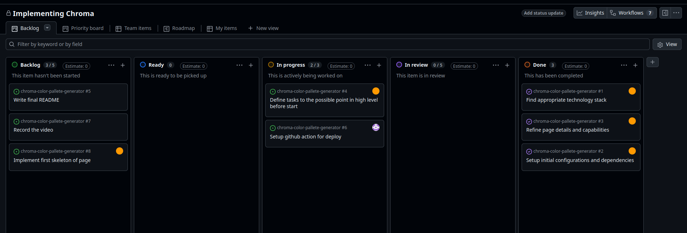

# گزارش آزمایش فرانت‌اند ایستا با استقرار خودکار

## 1. معرفی پروژه

**Chroma | Color Palette Generator** یک نرم‌افزار فرانت‌اند ایستا برای تولید، مشاهده و ویرایش پالت‌های رنگی است. هدف از پیاده‌سازی این پروژه علاوه بر ساخت یک رابط کاربری کاربردی، تمرین عملی فرآیند توسعه نرم‌افزار با **Git و GitHub**، کار گروهی روی یک Repository مشترک، استفاده از Branch و Pull Request، حل Conflict و در نهایت استقرار خودکار پروژه با **GitHub Actions** بوده است.

پروژه با **Vue 3، TypeScript، SCSS و Vite** توسعه داده شده و تمام قابلیت‌های آن در سمت کاربر اجرا می‌شوند؛ بنابراین برای اجرای برنامه به Backend یا Database نیاز نیست. برای عملیات رنگ از کتابخانه‌های `vue-color` و `@ctrl/tinycolor` نیز استفاده شده است.

لینک‌های اصلی پروژه:

- **GitHub Repository:** https://github.com/AM1648/chroma-color-pallete-generator
- **GitHub Pages:** https://am1648.github.io/chroma-color-pallete-generator/
- **GitHub Project / Kanban:** https://github.com/users/AM1648/projects/2

پروژه در ابتدا از یک ساختار ساده شامل پنج رنگ تصادفی و یک دکمه Generate شروع شد و سپس قابلیت‌ها در چند مرحله و از طریق Branchها و Pull Requestهای جداگانه به آن اضافه شدند. این روش باعث شد تاریخچه توسعه پروژه شامل Commitهای مشخص و معنادار باشد و هر قابلیت به‌صورت مستقل قابل بررسی و ادغام باشد.


### قابلیت‌های پیاده‌سازی‌شده

در نسخه نهایی پروژه قابلیت‌های زیر وجود دارند:

- تولید یک Palette تصادفی و تولید مجدد آن با دکمه **Generate**.
- نمایش مقدار هر رنگ در دو قالب **HEX** و **RGB**.
- کپی مقدار HEX یا RGB با کلیک مستقیم روی همان مقدار.
- ویرایش هر رنگ با استفاده از یک Color Picker.
- قفل‌کردن Color Cardها؛ رنگ‌های Lock شده هنگام Generate حفظ می‌شوند.
- تغییر مستقیم تعداد Color Cardها از طریق ورودی عددی.
- اضافه یا کم کردن Color Cardها با کنترل‌های `+ Color` و `- Color`.
- تولید Palette بر اساس Harmonyهای مختلف:
  - Random
  - Monochromatic
  - Complementary
  - Analogous
  - Triadic
  - Square

در طراحی اولیه ایده‌های بیشتری مانند History، Favorites، دسته‌بندی رنگ‌ها و Dark Mode نیز بررسی شدند، اما برای اینکه گزارش وضعیت واقعی Repository را نشان دهد، در این بخش فقط قابلیت‌هایی ذکر شده‌اند که در نسخه فعلی پروژه پیاده‌سازی شده‌اند.

---

## 2. اعضای تیم و تقسیم کار

پروژه به‌صورت گروهی و با مشارکت دو عضو روی یک Repository مشترک انجام شد:

- **AM1648** — سرگروه
- **AlirezaAsgarian** — عضو تیم

سرگروه وظیفه هماهنگی کلی روند پروژه، مدیریت Repository، کنترل ادغام تغییرات، هماهنگ نگه داشتن `main` و `dev` و پیگیری بخش CI/CD و استقرار را بر عهده داشت. توسعه قابلیت‌ها نیز بین اعضای تیم تقسیم شد و هر تغییر اصلی تا حد امکان در Branch مستقل انجام گرفت تا تغییرات یکدیگر را مستقیماً بازنویسی نکنند.

برای نمایش وضعیت کارها و تقسیم فعالیت‌ها از **GitHub Project / Kanban Board** استفاده شد. Taskها روی Board قرار گرفتند و روند انجام آن‌ها از حالت برنامه‌ریزی تا انجام قابل مشاهده بود. این Board علاوه بر مدیریت بهتر پروژه، مشارکت اعضای تیم را نیز شفاف می‌کند.



در طول توسعه، Review کردن Pull Requestها نیز بخشی از همکاری تیم بود. برای نمونه، قبل از ادغام بعضی تغییرات در `main`، عضو دیگر تیم Pull Request را بررسی و Approve کرده است. به این ترتیب فرآیند Merge تنها یک عملیات Git نبوده و مرحله Review نیز در روند توسعه وجود داشته است.

---

## 3. فرآیند توسعه با Git و GitHub

یکی از اهداف اصلی این آزمایش، استفاده عملی از Git در فرآیند توسعه بود. به همین دلیل پروژه با یک ساختار Branching مشخص پیش رفت و تغییرات اصلی مستقیماً روی `main` انجام نشدند.

دو Branch طولانی‌مدت اصلی پروژه عبارت بودند از:

- `main`: نسخه پایدار پروژه و مبنای استقرار روی GitHub Pages.
- `dev`: شاخه یکپارچه‌سازی و توسعه که قابلیت‌ها قبل از انتقال به `main` در آن جمع می‌شدند.

در کنار آن‌ها Branchهای Feature و Fix مختلفی ایجاد شدند. تعدادی از نمونه‌های مهم عبارت‌اند از:

- `feature/configurable-card-count`
- `feature/add-remove-color-cards`
- Branch مربوط به Color Lock
- Branchهای مربوط به Harmony
- Branchهای Fix برای مشکلات TypeScript و GitHub Pages

بعضی Feature Branchها پس از Merge حذف شده‌اند، اما تاریخچه آن‌ها از طریق Pull Requestها و Commitهای Repository همچنان قابل مشاهده است.

فرآیند معمول برای توسعه یک قابلیت به شکل زیر بود:

```text
dev
 ↓
Feature / Fix Branch
 ↓
تغییر و تست کد
 ↓
git add / git commit
 ↓
git push
 ↓
Pull Request
 ↓
Review / Approval
 ↓
Merge
```

در بخش‌هایی که Feature ابتدا در `dev` ادغام می‌شد، پس از تکمیل چند تغییر، یک Pull Request دیگر برای Merge کردن `dev` به `main` ساخته می‌شد. این ساختار باعث شد `main` تا حد امکان نسخه پایدار پروژه باقی بماند.


### Commitهای معنادار

در طول پروژه بیش از **۲۰ Commit معنادار** ایجاد شد. Commitها صرفاً برای افزایش تعداد Commit ساخته نشدند و هر کدام یک تغییر مشخص در پروژه را ثبت می‌کردند. موضوع Commitها شامل مواردی مانند موارد زیر بود:

- ایجاد ساختار اولیه Vue + TypeScript.
- تنظیم فایل `.gitignore`.
- ساخت نسخه اولیه Color Palette Generator.
- اضافه کردن Color Picker و امکان Edit.
- اضافه کردن HEX/RGB و قابلیت Copy.
- اضافه کردن Harmonyها.
- اضافه کردن Harmonyهای بیشتر.
- قابل تنظیم کردن تعداد کارت‌ها.
- اضافه کردن کنترل‌های Add/Remove.
- رفع خطاهای TypeScript و Build.
- اضافه کردن Color Lock.
- اصلاح GitHub Pages Workflow.
- تغییرات نهایی و اصلاح عنوان پروژه.

وجود این Commitهای کوچک‌تر و مشخص باعث شد تاریخچه توسعه قابل دنبال کردن باشد و در هنگام بروز مشکل نیز تشخیص تغییر مربوطه ساده‌تر شود.

### استفاده از `.gitignore`

از فایل `.gitignore` برای جلوگیری از Commit شدن فایل‌هایی استفاده شد که نباید وارد Repository شوند؛ به‌خصوص Dependencyهای محلی و فایل‌های تولیدشده در زمان Build. در عین حال `package-lock.json` در Repository نگه داشته شد تا نسخه Dependencyها بین اعضای تیم و محیط GitHub Actions یکسان و قابل تکرار باشد.

### Pull Request و Review

ادغام Featureها از طریق Pull Request انجام شد. Pull Requestها علاوه بر ایجاد یک مسیر مشخص برای Merge، امکان مشاهده Diff، Review و Comment روی تغییرات را فراهم کردند.

برای مثال:

- PR مربوط به Configurable Card Count، امکان تعیین تعداد Color Cardها را اضافه کرد.
- PR #29 کنترل‌های اضافه و کم کردن Color Cardها را اضافه کرد.
- PR #33 برای انتقال تغییرات `dev` به `main` استفاده شد.
- PRهای دیگری نیز برای Harmony، Fixهای TypeScript، GitHub Pages و Color Lock ایجاد شدند.

این روند باعث شد تغییرات قبل از ورود به نسخه اصلی قابل بررسی باشند و در صورت وجود Conflict یا مشکل Build، قبل از Merge نهایی اصلاح شوند.

### حل Conflictها

مطابق نیاز آزمایش، حداقل دو Merge Conflict در فرآیند توسعه ایجاد و برطرف شد.

**Conflict اول — PR #29**

دو Feature مستقل روی بخش‌های مشترک مربوط به مدیریت تعداد رنگ‌ها کار می‌کردند: یکی تعداد Color Cardها را قابل تنظیم می‌کرد و دیگری دکمه‌های Add/Remove را اضافه می‌کرد. پس از Merge شدن Feature اول، Pull Request دوم با `dev` Conflict پیدا کرد.

در Resolution به‌جای انتخاب کامل یکی از دو طرف، کد به شکلی ترکیب شد که **هر دو قابلیت** باقی بمانند؛ یعنی کاربر هم بتواند تعداد کارت‌ها را مستقیماً وارد کند و هم با `+ Color` و `- Color` تعداد آن‌ها را تغییر دهد.

**Conflict دوم — PR #33**

هنگام Merge کردن `dev` به `main`، نسخه `main` دارای Harmonyهای جدیدتری بود، در حالی که `dev` تغییرات مربوط به Card Count را داشت. در حل Conflict، نسخه نهایی به شکلی تنظیم شد که قابلیت‌های جدید تعداد کارت‌ها حفظ شوند و هم‌زمان Harmonyهای موجود در `main` نیز حذف نشوند.


این دو مورد نمونه عملی از این موضوع بودند که حل Conflict فقط حذف Markerهای Git نیست؛ بلکه لازم است منطق هر دو تغییر بررسی و نسخه نهایی به‌گونه‌ای ساخته شود که رفتار صحیح Featureها حفظ شود.

---

## 4. محافظت از شاخه `main`

برای جلوگیری از تغییر مستقیم نسخه اصلی پروژه، روی Branch `main` محدودیت اعمال شد.

قوانین اصلی عبارت بودند از:

- Merge تغییرات به `main` باید از طریق **Pull Request** انجام شود.
- حداقل **یک Approval** برای Merge مورد نیاز است.
- تغییرات ابتدا در Branchهای دیگر توسعه و بررسی می‌شوند و سپس به `main` منتقل می‌شوند.

به این ترتیب `main` به‌عنوان Branch پایدار پروژه در نظر گرفته شد و Featureهای در حال توسعه مستقیماً در آن Commit نشدند.


این Rule در کنار Pull Request و Review باعث شد فرآیند توسعه تیمی قابل کنترل‌تر باشد. همچنین چون GitHub Pages از `main` Deploy می‌شود، محافظت از این Branch از انتشار ناخواسته تغییرات ناقص نیز جلوگیری می‌کند.

---

## 5. استقرار خودکار با GitHub Actions

یکی دیگر از الزامات اصلی آزمایش، استقرار خودکار Static Frontend روی GitHub Pages بود. برای این منظور یک GitHub Actions Workflow در مسیر زیر ایجاد شد:

```text
.github/workflows/deploy-pages.yml
```

Workflow با Push شدن تغییر جدید روی `main` اجرا می‌شود و علاوه بر آن امکان اجرای دستی با `workflow_dispatch` نیز وجود دارد.

مراحل اصلی Workflow عبارت‌اند از:

1. دریافت Source Code با `actions/checkout`.
2. آماده‌سازی Node.js.
3. نصب دقیق Dependencyها با:

```bash
npm ci
```

4. Build پروژه با:

```bash
npm run build
```

5. آماده‌سازی GitHub Pages.
6. Upload شدن خروجی پوشه `dist`.
7. Deploy Artifact روی GitHub Pages.

نمای ساده این فرآیند:

```text
Merge / Push to main
        ↓
GitHub Actions
        ↓
Checkout Repository
        ↓
Setup Node.js
        ↓
npm ci
        ↓
npm run build
        ↓
Upload dist
        ↓
Deploy GitHub Pages
```


در طول توسعه Workflow نیز چند بار نیاز به اصلاح داشت. برای مثال مشکلات Build و TypeScript باعث شدند Pipeline در بعضی اجراها Fail شود و پس از رفع خطاها مجدداً اجرا شود. این موضوع باعث شد GitHub Actions فقط برای Deploy نهایی استفاده نشود، بلکه به‌عنوان یک بررسی عملی برای Build شدن صحیح پروژه نیز عمل کند.

پس از موفق بودن Jobهای Build و Deploy، نسخه جدید پروژه به‌صورت خودکار در GitHub Pages منتشر می‌شود و نیازی به Upload یا Deploy دستی وجود ندارد.

**نسخه آنلاین پروژه:**

https://am1648.github.io/chroma-color-pallete-generator/

---

## 6. استفاده از ابزارهای هوش مصنوعی

در این پروژه از ابزارهای هوش مصنوعی به‌عنوان **دستیار تحلیل، توسعه و رفع مشکل** استفاده شد. خروجی AI مستقیماً و بدون بررسی وارد پروژه نمی‌شد؛ پیشنهادها ابتدا بررسی شده، روی Repository اعمال و Build/Test می‌شدند و در صورت وجود مشکل، سؤال یا Prompt جدید برای اصلاح خروجی ارسال می‌شد.

جلسات اصلی مورد استفاده در پروژه عبارت‌اند از:

| ابزار / مدل | کاربرد اصلی | جلسه |
|---|---|---|
| DeepSeek / **DeepSeek V4 Flash (Instant)** | تحلیل صورت آزمایش، انتخاب ساختار پروژه، Refinement قابلیت‌ها و طراحی مسیر توسعه تدریجی | https://chat.deepseek.com/share/ff7uam0nhuvyqdeg61 |
| DeepSeek / **DeepSeek V4 Flash (Instant)** | راهنمای Git؛ Branch، upstream، restore، reset، clean، undo commit و هماهنگی `dev` و `main` | https://chat.deepseek.com/share/hmlq68vaafx8zqo49c |
| ChatGPT / **ChatGPT 5.6 Sol** | پیشنهاد و توسعه Color Lock و راهنمای ساخت Patch | https://chatgpt.com/share/6a80a4d8-cd60-83eb-bea0-9bf83e6a04b6 |
| ChatGPT / **ChatGPT 5.6 Sol** | ساخت دو Feature دارای Conflict، راهنمای PR #29 و حل Conflict هنگام Merge `dev` و `main` | https://chatgpt.com/share/6a80a53c-f300-83eb-a923-aadbe80063cd |

### نحوه استفاده از DeepSeek

جلسه اول DeepSeek بیشتر برای **تحلیل و طراحی اولیه پروژه** استفاده شد. ابتدا صورت آزمایش و محدودیت‌های آن به مدل داده شد و سپس درباره انتخاب پروژه Color Palette Generator، Tech Stack و شکل کلی توسعه بحث شد.

پس از آن Requirements به‌صورت مرحله‌ای دقیق‌تر شدند؛ برای مثال درباره موارد زیر تصمیم‌گیری شد:

- تعداد اولیه رنگ‌ها.
- نمایش HEX و RGB.
- Color Harmonyها.
- ویرایش رنگ با Color Picker.
- شکل کلی UI.
- تفکیک Componentها و Utilityها.
- نحوه توسعه تدریجی Featureها.

سپس یک نسخه اولیه ساده برای پروژه طراحی شد تا به‌جای پیاده‌سازی همه قابلیت‌ها در یک مرحله، امکانات به‌صورت Featureهای جداگانه اضافه شوند.

جلسه دوم DeepSeek بیشتر برای **دستورات Git و مشکلات Repository** مورد استفاده قرار گرفت. پرسش‌هایی مانند بازیابی فایل حذف‌شده، ساخت Branch از `dev`، اصلاح upstream اشتباه، هماهنگ کردن Branchها، `git reset`، `git clean` و Undo کردن Commit در این جلسه بررسی شدند.

### نحوه استفاده از ChatGPT

یکی از جلسات ChatGPT برای ایجاد دو Feature مرتبط با تعداد Color Cardها استفاده شد. هدف این بود که علاوه بر ایجاد دو قابلیت واقعی، بین آن‌ها یک Merge Conflict واقعی نیز ایجاد شود تا Requirement مربوط به Conflict Resolution به‌صورت عملی انجام شود.

دو Feature عبارت بودند از:

- قابل تنظیم کردن تعداد Color Cardها.
- اضافه کردن کنترل‌های `+ Color` و `- Color`.

پس از Merge Feature اول، PR #29 دچار Conflict شد. در ادامه فایل‌های درگیر بررسی و نسخه‌ای تهیه شد که هر دو قابلیت را حفظ کند.

در مرحله بعد، PR #33 برای Merge کردن `dev` به `main` با Harmonyهای جدید موجود در `main` Conflict پیدا کرد. در این مرحله نیز از AI برای مقایسه تغییرات و جلوگیری از حذف Featureهای موجود استفاده شد.

جلسه دیگر ChatGPT برای توسعه **Color Lock** استفاده شد. در این تعامل یک نمونه مشخص از نیاز به بررسی خروجی AI دیده شد: Patch اولیه تولیدشده معتبر نبود و فرمان زیر خطا داد:

```bash
git apply color-lock.patch
```

پس از ارسال خطای واقعی به مدل، Patch اصلاح شد. یک نسخه دیگر نیز با خطای `corrupt patch` مواجه شد و در ادامه Patch به‌صورت صحیح تولید و مجدداً با Git بررسی شد. این روند نمونه‌ای از تعامل چندمرحله‌ای با مدل است؛ یعنی پاسخ AI به‌عنوان نتیجه نهایی فرض نشد و خروجی آن با ابزار واقعی تست و در صورت نیاز اصلاح شد.

مدل دقیق ChatGPT در فایل‌های Export شده مشخص نشده است، بنابراین در این گزارش بدون حدس زدن نام مدل، از عنوان **ChatGPT** استفاده شده است.

---

## 7. نتیجه‌گیری

در این آزمایش یک Static Frontend واقعی با نام **Chroma** توسعه داده شد، اما بخش مهم پروژه تنها پیاده‌سازی UI نبود. فرآیند توسعه به شکلی انجام شد که مفاهیم اصلی Git و GitHub نیز به‌صورت عملی مورد استفاده قرار گیرند.

در طول پروژه:

- Repository مشترک برای اعضای تیم استفاده شد.
- `.gitignore` در پروژه وجود داشت.
- بیش از ۲۰ Commit معنادار ثبت شد.
- از `main`، `dev` و چندین Feature/Fix Branch استفاده شد.
- تغییرات از طریق Pull Request ادغام شدند.
- Branch `main` با Rule و Approval محافظت شد.
- حداقل دو Conflict واقعی حل شد.
- فعالیت‌ها از طریق Kanban Board مدیریت شدند.
- Build و Deployment با GitHub Actions خودکار شد.
- نسخه نهایی روی GitHub Pages در دسترس قرار گرفت.
- استفاده از ابزارهای هوش مصنوعی و نحوه تعامل با آن‌ها مستند شد.

در نتیجه، پروژه علاوه بر ارائه یک Color Palette Generator قابل استفاده، تجربه عملی Branching، Commit، Merge، Pull Request، Code Review، Conflict Resolution و CI/CD را نیز فراهم کرد.

### لینک‌های نهایی

- **Repository:** https://github.com/AM1648/chroma-color-pallete-generator
- **Live Application:** https://am1648.github.io/chroma-color-pallete-generator/
- **Kanban Board:** https://github.com/users/AM1648/projects/2
